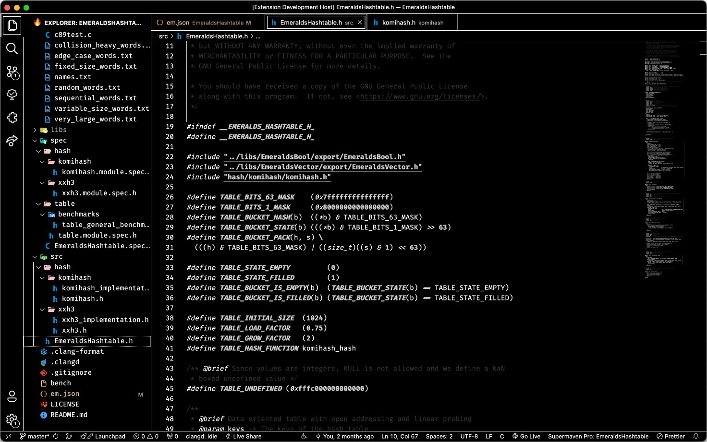

# E-Ink-陰陽 Theme for VSCode

## Thanks

Big props to hui890514 for creating the original theme -> https://marketplace.visualstudio.com/items?itemName=hui890514.vscode-theme-e-ink

## E-Ink-陰陽 Light

## E-Ink-陰陽 Dark

